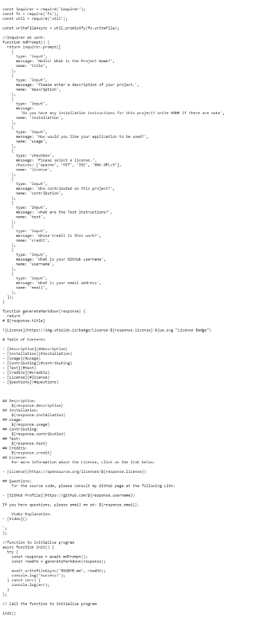
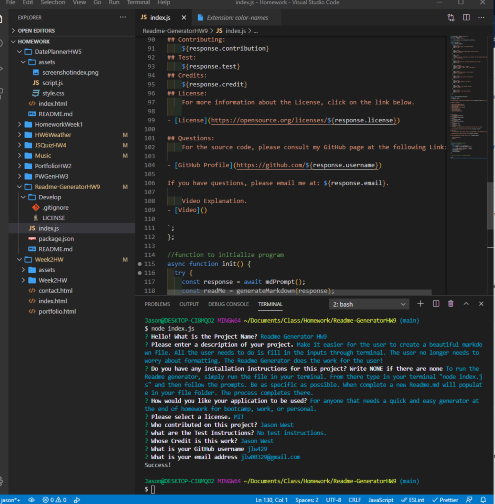
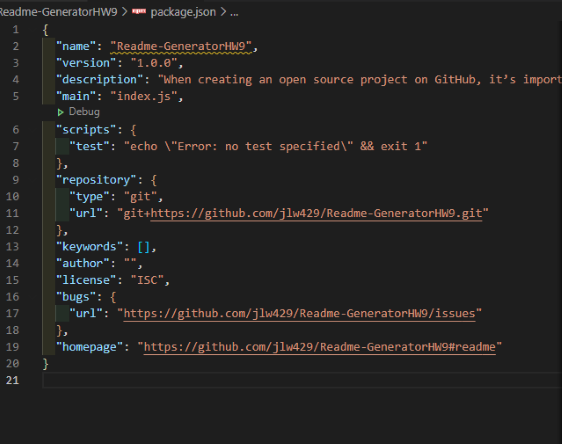
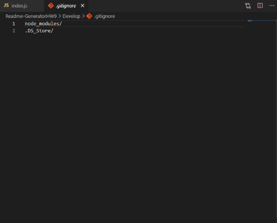

# Readme Generator HW9

# Table of Contents

- [Description](#description)
- [Installation](#installation)
- [Usage](#usage) 
- [Contributing](#contributing)
- [Test](#test)
- [Credits](#credits)
- [License](#license) 
- [Questions](#questions)

## Description:
    Make it easier for the user to create a beautiful markdown file. All the user needs to do is fill in the inputs through terminal. The user no longer needs to worry about formatting. The Readme Generator does the work for the user!
## Installation:
    To run the Readme generator, simply run the file in your terminal. From there type in your terminal "node index.js" and then follow the prompts. Be as specific as possible. When complete a new Readme.md will populate in your file folder. The process completes there.
## Usage:
    For anyone that needs a quick and easy generator at the end of homework for bootcamp, work, or personal. 
## Contributing:
    Jason West
## Test:
    No test instructions.
## Credits:
    Jason West
## License:
    For more information about the License, click on the link below.
    
- [License](https://opensource.org/licenses/MIT)

## Questions:
    For the source code, please consult my GitHub page at the following Link: 

- [GitHub Profile](https://github.com/jlw429)

If you have questions, please email me at: jlw00329@gmail.com.

    Video Explanation.
- [Video](https://drive.google.com/file/d/1hAF4yYoc-LLnUmyogv6IOvxS4zIhsWAE/view?usp=sharing)

# Screenshots

### Index.JS

### Terminal

### Package.JSON

### Gitignore
